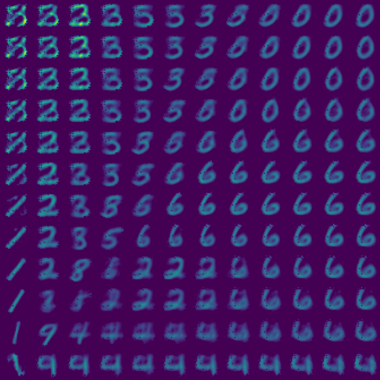
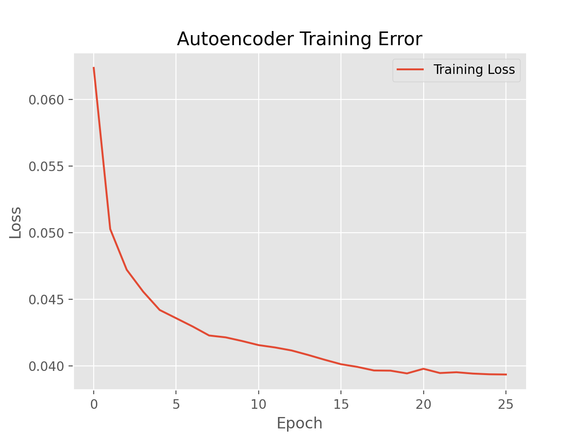

# autoencoders

An implemenatation of a regular autoencoder (AE), and also a variational autoencoder (VAE).

# Implementation

After 25 epochs of training, we can now visualise how the decoder reconstructs input--via sampling from the latent space. As seen, the reconstructed latent vectors visually look like numeric digits, and the position of each digit type corresponds with its location within the latent space.

A loss plot of training of the model used here is shown below.

