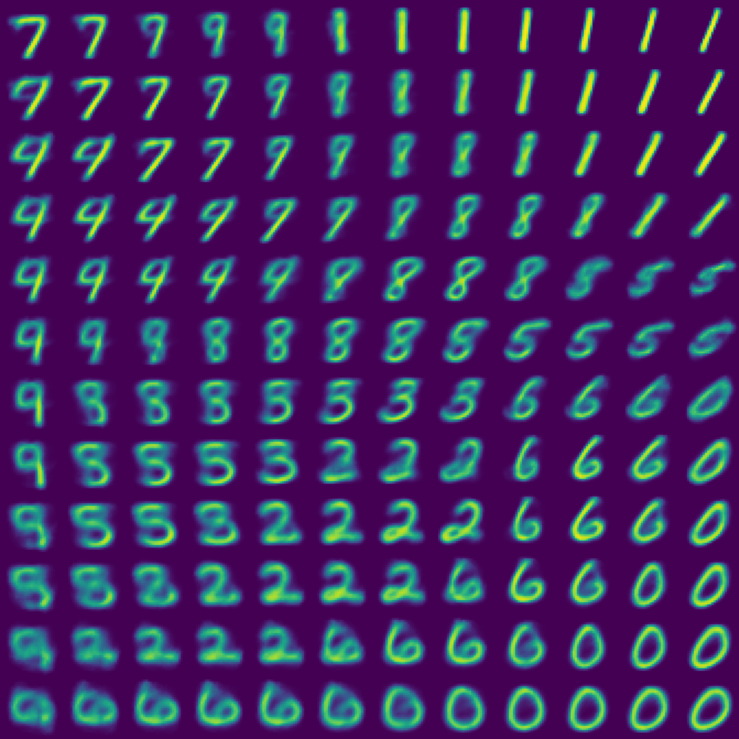

# autoencoders

An implemenatation of a regular autoencoder (AE), and also a variational autoencoder (VAE).

# AE Implementation

After 25 epochs of training, we can now visualise how the decoder reconstructs input--via sampling from the latent space. As seen, the reconstructed latent vectors visually look like numeric digits, and the position of each digit type corresponds with its location within the latent space.

One limit of the regular AE model is there are "gaps" in our latent space, in which data is never mapped to (i.e. the latent space is disjoint and non-continuous) -- see the top-left corner of the below figure. This becomes a significant problem if our AE was to be used as a generative model. 

# VAE Implementation

In a VAE, input is mapped to a probability distribution, and a latent vector is then sampled from that distribution. As a result, the decoder part of the network becomes better at decoding latent vectors.

After only 5 epochs of training, we can visualise how the VAE's decoder reconstructs input--again via sampling from the (now normalised) latent space. 

As compared with a regular AE, the reconstructed latent vectors have a clearer and more seperate boundary/region for each numeric digit. 

